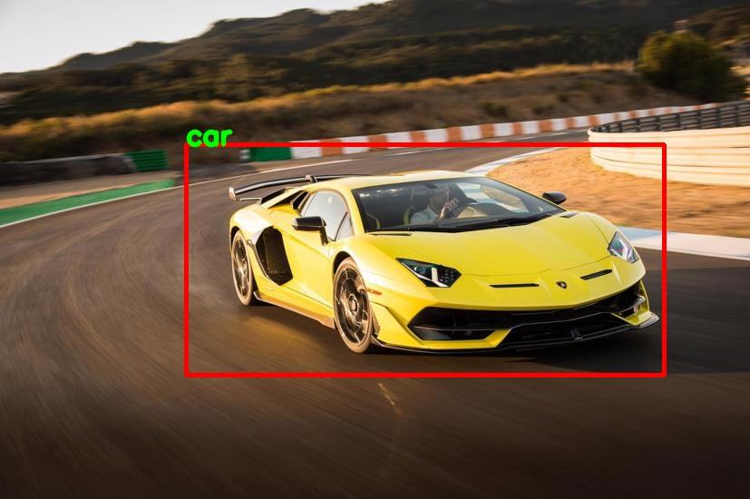
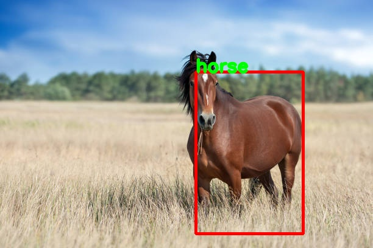
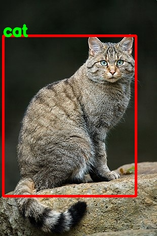
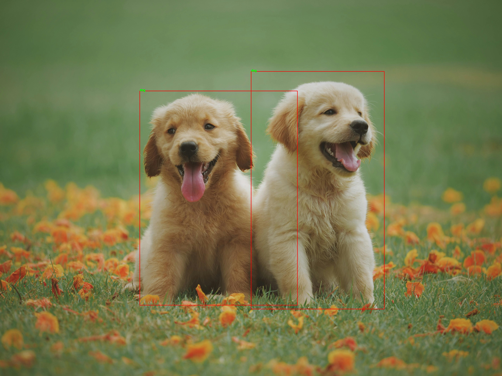

# [PYTORCH] Faster R-CNN (Region-Based Convolutional Neural Network)

## Introduction

Here is my pytorch implementation of the model described in the paper **VOC2012**  [paper](http://host.robots.ox.ac.uk/pascal/VOC/voc2012/index.html). 

## How to use my code

With my code, you can:
* **Train your model from scratch**
* **Train your model with my trained model**
* **Evaluate test images with either my trained model or yours**

## Requirements:

* **python**
* **pytorch**
* **opencv (cv2)**
* **tensorboard**
* **numpy**

  ## Datasets:

I used dataset: VOC2012. Statistics of datasets I used for experiments is shown below

| Dataset                | Classes | #Train images/objects | #Validation images/objects |
|------------------------|:---------:|:-----------------------:|:----------------------------:|
| VOC2007                |    20   |      5011/12608       |           4952/-           |
| VOC2012                |    20   |      5717/13609       |           5823/13841       |
| COCO2014               |    80   |         83k/-         |            41k/-           |
| COCO2017               |    80   |         118k/-        |             5k/-           |
- **VOC**:
  Download the voc images and annotations from [VOC2007](http://host.robots.ox.ac.uk/pascal/VOC/voc2007) or [VOC2012](http://host.robots.ox.ac.uk/pascal/VOC/voc2012). Make sure to put the files as the following structure:
  ```
  VOCDevkit
  ├── VOC2007
  │   ├── Annotations  
  │   ├── ImageSets
  │   ├── JPEGImages
  │   └── ...
  └── VOC2012
      ├── Annotations  
      ├── ImageSets
      ├── JPEGImages
      └── ...
  ```
  
- **COCO**:
  Download the coco images and annotations from [coco website](http://cocodataset.org/#download). Make sure to put the files as the following structure:
  ```
  COCO
  ├── annotations
  │   ├── instances_train2014.json
  │   ├── instances_train2017.json
  │   ├── instances_val2014.json
  │   └── instances_val2017.json
  │── images
  │   ├── train2014
  │   ├── train2017
  │   ├── val2014
  │   └── val2017
  └── anno_pickle
      ├── COCO_train2014.pkl
      ├── COCO_val2014.pkl
      ├── COCO_train2017.pkl
      └── COCO_val2017.pkl
  ```

  ## Results

Some output predictions for experiments for each dataset are shown below:
- **VOC2012**
<p align="center">
  <br/>
  <i>My model's output.</i>
</p>
  
